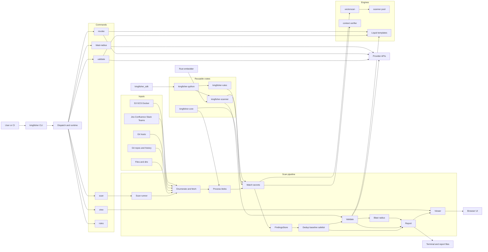
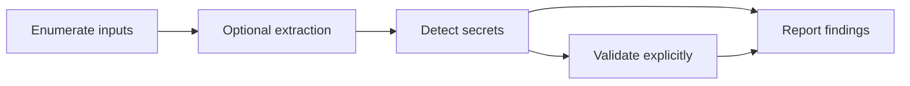

# Kingfisher Architecture

This document focuses on the runtime architecture of Kingfisher as implemented in this repository today.

It shows:

- a high-level component map of the main crates, modules, command paths, and outputs
- the execution flow for `kingfisher scan`
- shared detection, Rust/Python embedding, and optional detection settings

## Component Map

## What Lives Where

- `src/main.rs`: top-level command dispatch, Tokio runtime setup, allocator selection (mimalloc/jemalloc/system), update checks, and command routing.
- `src/scanner/runner.rs`: the orchestration hub for `scan`, including repo enumeration, clone streaming, artifact fetching, validation setup, sequential or parallel scan execution (threshold: >10 git repos triggers parallel mode), reporting, and summary generation.
- `src/scanner/*`: input enumeration (`enumerate.rs`), repository handling and artifact fetching (`repos.rs`), blob processing (`processing.rs`), validation coordination (`validation.rs`), scan summaries (`summary.rs`), Docker image scanning (`docker.rs`), and utilities (`util.rs`).
- `src/matcher/*`: CLI detection orchestration (`mod.rs`), Vectorscan callbacks, capture conversion, filtering (`filter.rs`), and component association. Base64 discovery, fingerprints, confirmation indexes, and postprocessing reuse the scanner crate.
- `src/parser.rs` and `src/inline_ignore.rs`: compatibility re-exports of the shared parser and inline-ignore implementations in `crates/kingfisher-scanner/src/context/`.
- `src/scanner_pool.rs`: compatibility re-export of the shared thread-local Vectorscan scanner pool, providing safe reuse of compiled databases across scan threads.
- `crates/kingfisher-scanner/src/`: embeddable scan orchestration (`scanner.rs`), matching primitives and indexes (`primitives.rs`), opaque optimized confirmation (`confirmation.rs`), component-window and suppression helpers (`postprocess.rs`), cooperative controls (`scan_control.rs`), and optional context, Git, extraction, archive, and validation modules.
- `crates/kingfisher-rules/src/rules_database.rs`: compiled rule catalog, confirmation regexes, lazily cached endpoint regexes and byte-length bounds, source-path prefilters, and compiled finding filters.
- `crates/kingfisher-python/src/`: PyO3 ownership and conversions, native input/Git adapters, execution controls, and bindings to shared detection, extraction, validation, and revocation.
- `python/kingfisher_sdk/`: Python argument checks and composition, including `ScanInput` enumeration, explicit content transforms, `Scanner`/`DetectionScanner`, and separate validation, revocation, and reporting interfaces.
- `src/reporter.rs` and `src/reporter/*`: report rendering for pretty, JSON, BSON, TOON, SARIF, and HTML outputs, plus the data model used by the viewer.
- `src/direct_validate.rs`: direct validation of a known secret without going through pattern matching. Supports HTTP, gRPC, plus schema-level typed validators such as AWS, AzureStorage, CredentialUri, GCP, JDBC, MongoDB, MySQL, PostgreSQL, JWT, and Coinbase, and delegates ad-hoc `Raw` validators to `crates/kingfisher-scanner/src/validation/raw.rs`.
- `src/direct_revoke.rs`: direct revocation of a known secret without going through the scan pipeline. Uses Liquid templates for revocation configurations and supports multi-step HTTP revocation flows.
- `src/access_map.rs` and `src/access_map/*`: standalone blast-radius mapping with 43 provider implementations including AWS, Azure, GCP, GitHub, GitLab, Slack, Bitbucket, Gitea, Hugging Face, Buildkite, Anthropic, OpenAI, and more.
- `tools/rule-bundle/` and `crates/kingfisher-rules/build_support/{betterleaks,veles}.rs`:
  the maintainer tool archives pinned upstream sources and translates them into the prepared
  compressed catalog in `crates/kingfisher-rules/generated/`. Normal compilation embeds this
  bundle without fetching rule sources. The manifest records input and output hashes.
- `crates/kingfisher-rules/data/imported-rules-capabilities.yml`: Kingfisher-only operational bindings
  and selected safe revocation actions keyed by upstream detector ID. It contains no candidate
  detector regexes, but may add narrow operational filters and capability metadata; the generator rejects
  stale IDs and component references.

## Shared Detection And Embedding

The CLI matcher and embeddable scanner have separate orchestration around shared
matching primitives, parsers, component-window predicates, credential-URI fallback
suppression, and catalog deduplication. Python calls the embeddable scanner through
PyO3 in process, reuses compiled rules and scanner resources, and releases the GIL
for native scanning. The CLI continues to own source discovery, scan-wide storage,
provider coordination, and report rendering.

Embedding keeps the stages composable:

Enumeration selects inputs and retains source provenance. Archive expansion and
SQLite/bytecode extraction are explicit transforms; their findings refer to the
extracted content. Detection scans supplied content offline. Validation and
revocation remain separate operations. Python keeps findings grouped with their
logical input path and provenance; invisible component helpers remain available
until dependent operations finish. See the [Python SDK guide](../reference/python-bindings.md).

### Detection Settings And Compatibility

Detection settings are ordinary options controlling matching, decoding, and
candidate filtering. Rust exposes `context::DetectionOptions` through
`scan_blob_at_path_with_options` and
`scan_blob_at_path_with_options_and_control`. Python exposes the same settings
through immutable `DetectionPolicy` objects passed to `Scanner(policy=...)`;
`DetectionScanner` is a compatibility facade over the same constructor. Existing
`Scanner` entry points retain their defaults;
enabling a Cargo feature alone does not opt a scan into different behavior.

| Behavior | Existing `Scanner` defaults | Default detection options / `DetectionScanner` |
| --- | --- | --- |
| Initial raw confirmation window | 64 KiB | 4 KiB, matching the CLI |
| Component proximity anchor | Selected secret span | Full regex-match span |
| Per-rule secret containment suppression | Disabled | Enabled |
| Overlapping Betterleaks credential-URI fallback suppression | Disabled | Enabled |
| Base64 decoding depth | One layer | Two layers |
| Original-input limit for Base64 decoding | Uncapped | 64 MiB; raw detection still runs above the cap |
| Inline-ignore and HTML/CSS filtering | Disabled | Enabled |

Confirmation windows widen when needed, so their initial size does not limit
secret length. Alignment can change offsets and fingerprints in long fixed-width
runs. `cli_match_semantics=false` selects legacy matching; Base64 depth, input cap,
inline-ignore handling, and markup checks are configured independently. Full-match
and decoded-secret spans stay private. Public `Finding` fields and serialization
remain unchanged, and Base64 findings retain the outer encoded region's locations.
Shared detection settings do not promise identical CLI source selection,
validation, reporting, or fingerprint contracts.

### Detection Order And Failure Boundaries

An embeddable scan with the optional settings enabled passes through these stages:

1. Vectorscan selects candidates in raw content and eligible decoded Base64
   content. Rust regexes confirm captures; entropy and rule filters reject candidates.
2. Inline-ignore directives and per-rule secret containment checks remove candidates.
3. HTML/CSS parser verification checks ambiguous candidates. Self-identifying and
   Base64 candidates bypass this stage; inputs above 2 MiB and secrets with invalid
   UTF-8 retain candidates because structural verification cannot reliably reject them.
4. Required components are checked using shared full-match proximity predicates.
   Overlapping specific Betterleaks findings suppress credential-URI fallbacks.
5. Catalog deduplication resolves coincident imported detectors.
6. Redaction runs, execution controls are checked, and successful nonempty scans
   commit optional cross-call dedup state before returning owned findings.

Filtering precedes component checks so an ignored helper cannot satisfy a required
credential. `ScanControl` provides cooperative deadlines and cancellation between
matching/filtering operations and in Vectorscan callbacks. Individual native
operations, reads, and decoding cannot be preempted. Failed or interrupted scans
return errors without partial findings or dedup commits. Python maps deadline
expiry to `TimeoutError` and cancellation to `RuntimeError`; previously yielded
input groups remain with the caller.

Cross-call deduplication keys the blob ID and logical path, excluding detection
options. Reuse a scanner for one set of settings when deduplication is enabled.
An in-flight scan can commit after `reset_dedup()`; finish concurrent scans before
resetting for a new batch.

### Implementation And Feature Boundaries

- `context` enables the optional detection-settings API and parser dependencies.
  `git` enables read-only scope enumeration with shared commit metadata and
  tree diffs that skip unchanged subtrees; the CLI reuses the tree-diff adapter.
  `extraction` enables SQLite/bytecode helpers and implies `archives`.
  `validation` gates all validators and revokers; detection alone remains offline.
- `__cli-internals` exposes unsupported CLI integration helpers, including parser,
  inline-ignore, index, confirmation, and postprocessing interfaces.
  `__scanner-internals` in the rules crate exposes cached regex bounds to the scanner.
  Neither feature is a stable embedding API; supported entry points are documented
  in the [library guide](../reference/library.md#optional-cli-detection-policies-and-content-extraction).
- Confirmation byte-length bounds are parsed once per rule with the rule's regex
  flags. Positive-width rules without HIR assertions reuse indexed captures at
  complete match endpoints after checking window alignment. Partial endpoints
  resume at the last complete match, preserving the original regex's choice in
  the EOF tail while avoiding repeated searches across lazy spans. Windows
  starting in an unmatched gap preserve alignment directly; windows starting
  inside an indexed match still require the original first-match check.
  Assertion-sensitive rules retain the
  guarded search and synchronized-tail fallback. Arbitrary public regex
  constructors retain conservative searches because
  builder-only flags cannot be recovered from pattern text.
- Candidate indexes are built only when repeated endpoints justify them. CLI
  indexes cover bounded input segments; shifted confirmation sequences cache jumps
  lazily instead of allocating a duplicate hash entry for every indexed match.
  Optimized confirmation state is opaque, while the existing public confirmation
  enum retains its exhaustive-match contract.
- Inline-ignore indexes are lazy and scoped to one blob, avoiding retained line
  indexes on long-lived matcher workers. Confirmation chain walks and optimized
  iteration also check cooperative execution controls.

## Notes And Boundaries

- `src/main.rs` owns process setup and command dispatch. Private binary modules in
  `src/app/` handle project configuration, configuration generation, and rule commands.
  `src/lib.rs` is the application library façade; filesystem enumeration and Git
  opening are implemented in the private `src/input.rs` module and re-exported
  through their existing public paths.
- Within `src/scanner/`, `runner.rs` coordinates scan phases, `discovery.rs` owns
  repository discovery and artifact workers, `roots.rs` groups local inputs,
  `storage.rs` batches datastore writes, and `rule_loading.rs` manages compilation
  and the rule cache. These implementation modules remain private.
- `src/reporter/commands.rs` generates suggested validation, revocation, and
  access-map commands; the report builder and format-specific renderers consume them.
- The rules crate owns the shared native scanner pool used by the CLI matcher,
  embeddable scanner, and compiled rule filters. Its thread-local scratch arenas
  are dropped before their database, and fallible callers propagate allocation,
  reentrancy, and matching errors.
- Pull-request CI checks Clippy and API documentation with warnings denied using Rust 1.99,
  the workspace minimum and pinned build compiler. It checks the scanning-only
  feature configuration independently of workspace feature unification.
- The main CLI scan path is implemented primarily in the application modules under `src/`, not in `kingfisher-scanner`.
- `kingfisher-scanner` is still important: it provides the embeddable scanner API plus shared validation and primitive functionality reused by the application.
- The shared validation layer in `crates/kingfisher-scanner/src/validation/` contains the embeddable
  `ValidationEngine`, Betterleaks expression runtime, gRPC transport, typed validator families,
  and `Raw` exception-path validators. The engine dispatches and classifies validation for all
  three callers: the embeddable `Validator`, CLI scans, and direct `validate` commands.
  `Validator` associates supporting findings and bounds concurrency. The CLI adds candidate
  selection, rate limiting, scan-scoped caches, and reporting around the same engine; see the
  [library integration guide](../reference/library.md#use-the-validation-builder).
- Direct `validate`, `revoke`, and standalone `blast-radius` are sibling command paths. They are not downstream stages of `FindingsStore`.
- Reporting is downstream from the datastore, which lets Kingfisher emit multiple output formats and drive the local viewer from the same finding set.
- Every rule uses Vectorscan's high-throughput SIMD-accelerated database for candidate detection. The exact Rust regex then confirms captures before imported-rule filters, Base64 handling, and parser-based context verification improve accuracy and reduce false positives. No rule performs an unconditional whole-blob regex scan.
- Betterleaks' top-level source prefilter is compiled once into a separate Vectorscan database and
  evaluated per source path before content matching. Keyword hints are not imported because
  Vectorscan already supplies content-candidate selection. Only the global finding filter and
  per-rule finding filter are combined.
- Regex helpers inside the combined Betterleaks finding filters are also compiled once into shared
  Vectorscan databases. `findMatch` uses start-of-match tracking; boolean helpers use normal block
  matching.
- `FindingsStore` uses an in-memory store with cryptographic-digest deduplication, replacing the earlier SQLite-based storage model.
- Betterleaks validation expressions run through a portable Rust AST evaluator. Kingfisher custom-rule
  validation and revocation templates use Liquid for HTTP request sequences, variable extraction,
  and multi-step flows.
- Betterleaks access-map and revocation behavior is capability-driven. Runtime dispatch uses typed
  handlers and declarative finding/component bindings, never old `kingfisher.*` rule IDs.
