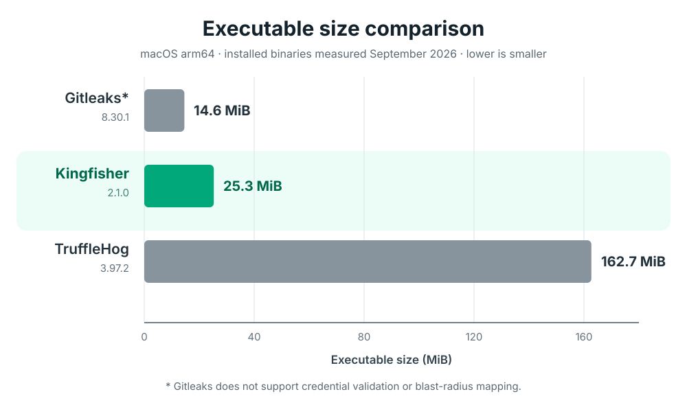

# Capabilities and Benchmarks

**Of the secret scanning tools compared below, only Kingfisher and Betterleaks 2.0
offer built-in credential revocation.** Find exposed secrets, verify which are live,
identify their owners, and revoke supported credentials—all open source, with no
paid edition required.

| Built-in capability | Kingfisher | Betterleaks 2.0 RC1 | TruffleHog OSS | Gitleaks |
|---|:---:|:---:|:---:|:---:|
| Secret discovery | ✅ | ✅ | ✅ | ✅ |
| Live credential verification | ✅ | ✅ | ✅ | ❌ |
| Identity and permission analysis | ✅ | ✅ | ✅ | ❌ |
| **Credential revocation** | **✅** | **✅** | ❌ | ❌ |
| License | Apache-2.0 | MIT | AGPL-3.0 | MIT |

✅ Supported · ❌ Not built in. Provider coverage and permissions vary.
Betterleaks **2.0.0-rc.1** is a prerelease; revocation requires an explicit action.

Feature review: September 30, 2026. Sources:
[Kingfisher revocation](../features/revocation.md),
[Betterleaks 2.0 RC1](https://github.com/betterleaks/betterleaks/blob/v2.0.0-rc.1/README.md),
[TruffleHog source and capabilities](https://github.com/trufflesecurity/trufflehog/tree/19f011aca35e0fb30601c9407a4afbaeb02aad53),
and [Gitleaks source and capabilities](https://github.com/gitleaks/gitleaks/tree/b58d3f102cf3a2c84cb7f923d05c25c9b1aed84b).
Revocation means invalidating credentials through the provider, not merely checking
their status. No built-in revocation command was found in the reviewed TruffleHog
or Gitleaks source.

## Published benchmarks

These historical measurements are separate from the Kingfisher and Betterleaks 2.0
revocation capabilities described on the homepage. Betterleaks 2.0 was not included
in these benchmarks.

## Runtime Comparison (seconds)
*Lower runtimes are better.*

| Repository | Kingfisher Runtime | TruffleHog Runtime | Gitleaks Runtime |
|------------|--------------------|--------------------|------------------|
| croc | 2.64 | 10.36 | 3.10 |
| rails | 8.75 | 24.19 | 24.24 |
| ruby | 22.93 | 132.68 | 61.37 |
| gitlab | 135.41 | 325.93 | 350.84 |
| django | 6.91 | 227.63 | 59.50 |
| lucene | 15.62 | 89.11 | 76.24 |
| mongodb | 25.37 | 174.93 | 175.80 |
| linux | 205.19 | 597.51 | 548.96 |
| typescript | 64.99 | 183.04 | 232.34 |

  

### Validated/Verified Findings Comparison

Gitleaks does not perform live validation; its verified counts are **N/A**, not zero.

| Repository | Kingfisher Validated | TruffleHog Verified | Gitleaks Verified |
|------------|----------------------|---------------------|-------------------|
| croc | 0 | 0 | N/A |
| rails | 0 | 0 | N/A |
| ruby | 0 | 0 | N/A |
| gitlab | **6** | **6** | N/A |
| django | 0 | 0 | N/A |
| lucene | 0 | 0 | N/A |
| mongodb | 0 | 0 | N/A |
| linux | 0 | 0 | N/A |
| typescript | 0 | 0 | N/A |

### Network Requests Comparison
*'Network Requests' shows HTTP calls recorded during these scans. Gitleaks does not perform live credential validation; zero here describes this benchmark, not every possible network interaction.*

| Repository | Kingfisher Network Requests | TruffleHog Network Requests | Gitleaks Network Requests |
|------------|-----------------------------|-----------------------------|---------------------------|
| croc | 0 | 17 | 0 |
| rails | 1 | 25 | 0 |
| ruby | 3 | 33 | 0 |
| gitlab | 17 | **15624** | 0 |
| django | 0 | 66 | 0 |
| lucene | 0 | 116 | 0 |
| mongodb | 1 | 191 | 0 |
| linux | 0 | 287 | 0 |
| typescript | 0 | 10 | 0 |

*Lower runtimes are better. Validated/Verified counts are reported where available. 'Network Requests' indicates the number of HTTP requests made during scanning.*

### Binary Size Comparison (macOS arm64)

| Tool | Reported Version | Executable Size |
|------|------------------|-----------------|
| Gitleaks* | 8.30.1 | 14.6 MiB (15,301,234 bytes) |
| **Kingfisher** | **2.1.0** | **25.3 MiB (26,557,520 bytes)** |
| TruffleHog | 3.97.2 | 162.7 MiB (170,552,610 bytes) |

  

* Gitleaks does not support credential validation or blast-radius mapping.

*Measured in September 2026 from the unaltered installed macOS arm64 executables. Versions are the
values reported by each executable. Smaller binaries are easier to distribute, deploy in CI, and
embed in container images.*

## Benchmark Environment

OS: darwin
Architecture: arm64
CPU Cores: 16
RAM: 48.00 GB
